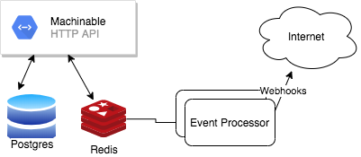
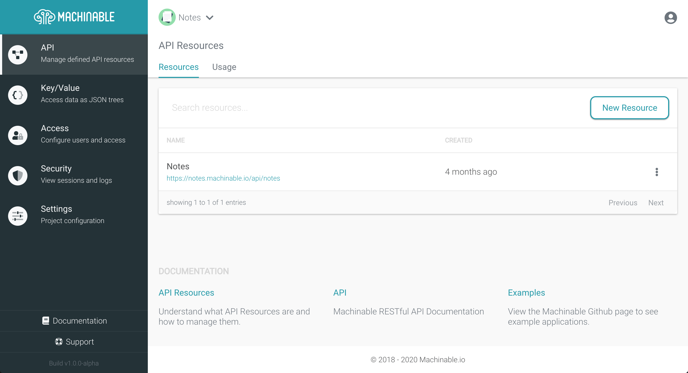

Machinable gives developers the ability to store and manage their application's data in a structured, validated, RESTful way without having to write any backend code.

See the [User Documentation](https://www.machinable.io/documentation/) for more information.

[](https://img.shields.io/github/v/tag/machinable/machinable)

#### Build

Install and build the API docker image.

```
# install dependencies and build the docker image
$ make build

# run container
$ make up
```

#### Dev Environment

##### hosts

The Machinable API requires a valid hostname (with subdomain) to process requests, so you'll need to update your hosts file to include the following

```
127.0.0.1   manage.machinable.test
127.0.0.1   some-project.machinable.test
127.0.0.1   another-project.machinable.test
```

`127.0.0.1   manage.machinable.test` is required, the other lines are for any project slugs you need to test locally.

##### Environment

Set local environment variables

```sh
echo "export SENDGRID_API_KEY='YOUR_API_KEY'" > dev.env
source ./dev.env
```

`SENDGRID_API_KEY` is used for the [email-notifications](https://github.com/anothrNick/email-notifications), which is used to send emails to users (email verification, misc. notifications).


##### Configuration

The application config has the following structure:

```json
{
    "Version": "0.0.0",
    "AppSecret": "",
    "ReCaptchaSecret": "",
    "IPStackKey": "",

    "TemplateMap": {
        "default": "/templates/default.html"
    },
    "SenderName": "Machinable",
    "SenderEmail": "noreply@machinable.test"
}
```

|Key|Description|Required|
|---|-----------|--------|
|**Version**|The version of the API|`False`|
|**AppSecret**|The secret string used to salt passwords|`True`|
|**ReCaptchaSecret**|The Google reCaptcha secret used for user registration|`True`|
|**IPStackKey**|The API Key for IP Stack|`False`|
|**TemplateMap**|A map of template names to HTML template file paths. _inherited from [email-notifications](https://github.com/anothrNick/email-notifications)_|
|**SenderName**|The name of the email sender. _inherited from [email-notifications](https://github.com/anothrNick/email-notifications)_|
|**SenderEmail**|The email of the sender. _inherited from [email-notifications](https://github.com/anothrNick/email-notifications)_|

The secret config values can also be provided as environment variables in `docker-compose.yml`:

```yml
    - APP_SECRET
    - RECAPTCHA_SECRET
    - IPSTACK_KEY
```

#### Testing

Run unit tests with the following command:

```
# run with make command
$ make test

# run with go test
$ go test ../... -v
```

#### CI

Github Tag Action - [https://github.com/anothrNick/github-tag-action](https://github.com/anothrNick/github-tag-action)

See [./github/workflows/main.yml](./github/workflow/main.yml) for the full Github workflow.

#### Packages

Docker Image: [machinable](https://github.com/machinable/machinable/packages/54301)

### Local Development

`make install build up` will install dependencies, build images, and run the necessary containers for a local environment. This includes the posgres, redis, and api containers. The containers are defined in `docker-compose.yml`.

_NOTE: `docker-compose.yml` should only be used for your local development environment, as it uses clear text credentials for the database_

### Architecture



#### API

The Machinable HTTP API is used for all resources of the application (this repo). The API is written in Golang. 

#### Redis

Redis is used as a caching layer for API request counts, as well as a queue for [web hook] event processing.

#### Postgres

Postgres is the database used to store all data. The JSONB column type is particularly important, as it is how API Resource and Key/Value objects are stored.

See [./sql/create.sql](./sql/create.sql) for the full application schema.

#### Event Processor

The [event processor](https://github.com/machinable/event-processor) is used to read Web Hook events off of the redis queue and send them to the configured URL.

#### Email Notifications

The [email-notifications](https://github.com/anothrNick/email-notifications) container reads notifications from Redis and sends them to the email in the notification body.

#### Web UI

_NOTE: See the [UI repository](https://github.com/machinable/machinable-ui) for information on how to run the UI._


